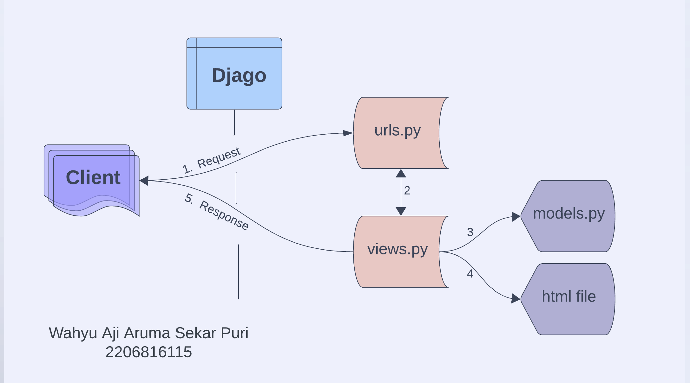

- Nama: Wahyu Aji Aruma Sekar Puri
- NPM: 2206816115
- Kelas: B
- Kode Asdos: EDA

- TUGAS 5
1. Jelaskan manfaat dari setiap element selector dan kapan waktu yang tepat untuk menggunakannya.
Dalam pengembangan web dan CSS (Cascading Style Sheets), pemilih elemen digunakan untuk menargetkan dan menata gaya elemen HTML pada halaman web. Ada beberapa jenis penyeleksi elemen, masing-masing memiliki manfaat dan kasus penggunaan yang sesuai. 
# Type Selector (Element Selector)
Type selectors menargetkan elemen HTML tertentu berdasarkan nama tagnya. Mereka lugas dan mudah digunakan.
Penggunaan yang tepat: Pemilih jenis biasanya digunakan saat Anda ingin menerapkan gaya yang konsisten pada jenis elemen tertentu di seluruh situs web Anda. Misalnya, menata semua elemen <h1> dengan font dan warna tertentu.

2. Jelaskan HTML5 Tag yang kamu ketahui.
Seperti yang kita ketahui bahwa HTML5 merupakan versi baru dari HTML (Hypertext markup Language). HTML5 memperkenalkan banyak tag baru yang akan menguntungkan banyak pengembang. Tag ini umumnya didukung oleh semua browser utama. Tag ini dimiliki oleh banyak aspek seperti grafik, media, dan formulir.
Berikut beberapa elemen yang diperkenalkan di HTML5:
- Tag <artikel>: Tag <artikel> adalah salah satu elemen pembagian baru di HTML5. Tag HTML <article> digunakan untuk mewakili sebuah artikel. Lebih khusus lagi, konten dalam tag <article> tidak bergantung pada konten situs lainnya (walaupun mungkin terkait).
- Tag <aside>: Tag <aside> digunakan untuk mendeskripsikan objek utama halaman web dengan cara yang lebih singkat seperti stabilo. Ini pada dasarnya mengidentifikasi konten yang terkait dengan konten utama halaman web tetapi bukan merupakan maksud utama halaman utama. Tag <aside> terutama berisi informasi penulis, tautan, konten terkait, dan sebagainya.
- Tag <audio>: Tag <audio> digunakan untuk menyisipkan audio ke halaman web HTML.
- Tag <canvas>: Tag <canvas> dalam HTML digunakan untuk menggambar grafik pada halaman web menggunakan JavaScript. Ini dapat digunakan untuk menggambar jalur, kotak, teks, gradien, dan menambahkan gambar. Secara default, ini tidak mengandung batas dan teks.
- Tag <command>: Tag <command> mendefinisikan tombol perintah, dipanggil sesuai tindakan pengguna. Tombol tag <command> digunakan dalam jenis operasi khusus. Tag <command> hanya didukung oleh Internet Explorer.

3. Jelaskan perbedaan antara margin dan padding.
Perbedaan utama antara padding CSS dan margin adalah padding adalah ruang antara konten dan batas elemen (di dalam elemen itu sendiri), sedangkan margin adalah ruang di sekitar batas elemen.
Padding adalah properti CSS yang hanya berfungsi pada elemen yang memiliki batas. Ini menciptakan ruang antara batas dan konten suatu elemen. Jadi, perlu diingat bahwa padding tidak berpengaruh pada elemen yang tidak memiliki batas.
Margin membentuk ruang di luar batas elemen. Tidak seperti padding, margin masih dapat mempengaruhi suatu elemen apakah elemen tersebut memiliki batas atau tidak.
Perbedaan lainnya adalah warna latar belakang padding dan batas dapat disesuaikan, sedangkan margin transparan. – dengan itu, warna latar belakang tema situs web akan ditampilkan.

4. Jelaskan perbedaan antara framework CSS Tailwind dan Bootstrap. Kapan sebaiknya kita menggunakan Bootstrap daripada Tailwind, dan sebaliknya?
Bootstrap digunakan untuk membuat aplikasi web dan seluler yang responsif sedangkan Tailwind CSS digunakan untuk membuat antarmuka pengguna yang disesuaikan.
- Tailwind:
a. Tailwind CSS membangun tampilan dengan menggabungkan kelas-kelas utilitas yang telah didefinisikan sebelumnya.
b. Tailwind CSS memiliki file CSS yang lebih kecil sedikit dibandingkan Bootstrap dan hanya akan memuat kelas-kelas utilitas yang ada
c. Tailwind CSS memiliki memberikan fleksibilitas dan adaptabilitas tinggi terhadap proyek
d. Tailwind CSS memiliki pembelajaran yang lebih curam karena memerlukan pemahaman terhadap kelas-kelas utilitas yang tersedia dan bagaimana menggabungkannya untuk mencapai tampilan yang diinginkan.
- Bootstrap
a. Bootstrap menggunakan gaya dan komponen yang telah didefinisikan, yang memiliki tampilan yang sudah jadi dan dapat digunakan secara langsung.
b. Bootstrap memiliki file CSS yang lebih besar dibandingkan dengan Tailwind CSS karena termasuk banyak komponen yang telah didefinisikan.
c. Bootstrap sering kali menghasilkan tampilan yang lebih konsisten di seluruh proyek karena menggunakan komponen yang telah didefinisikan.
d. Bootstrap memiliki pembelajaran yang lebih cepat untuk pemula karena dapat mulai dengan komponen yang telah didefinisikan.

5. Jelaskan bagaimana cara kamu mengimplementasikan checklist di atas secara step-by-step (bukan hanya sekadar mengikuti tutorial).
- Langkah 1: Mempersiapkan Proyek Django
a. Buka proyek Django yang telah ada (shopping_list).
b. Buka file base.html yang terletak dalam folder templates di root proyek.
- Langkah 2: Menambahkan Tag <meta>
a. Di dalam tag <head> pada file templates/base.html, tambahkan tag <meta name="viewport"> untuk membuat halaman web menyesuaikan ukuran dan perilaku perangkat mobile (jika belum ada).
- Langkah 3: Menambahkan Bootstrap CSS dan JS
a. Tambahkan Bootstrap CSS dan jQuery (JS) ke dalam tag <head> pada file templates/base.html.
- Langkah 4 (Opsional): Menambahkan Script untuk Dropdowns, Popovers, Tooltips
a. Jika ingin menggunakan dropdowns, popover, dan tooltips dari Bootstrap, tambahkan dua script JS berikut di bawah script JS yang sudah ada.
- Langkah 5: Menambahkan Navigation Bar (Navbar) pada main.html
a. Tambahkan navbar (Navigation Bar) pada halaman main.html, termasuk nama Anda dan tombol logout.
b. Gunakan referensi dari dokumentasi Bootstrap untuk membuat navbar sesuai dengan preferensi Anda.
- Langkah 6: Menambahkan Fitur Edit pada Aplikasi
a. Buka views.py dalam subdirektori main dan buat fungsi baru bernama edit_product yang menerima parameter request dan id.
b. Tambahkan potongan kode untuk mengedit produk dan menyimpannya.
- Langkah 7: Membuat Template untuk Edit Produk (edit_product.html)
a. Buat berkas HTML baru dengan nama edit_product.html dalam subdirektori main/templates.
b. Isi berkas tersebut dengan template yang disediakan, termasuk form untuk mengedit produk.
- Langkah 8: Konfigurasi URL untuk Edit Produk
a. Buka urls.py dalam folder main dan impor fungsi edit_product yang telah dibuat.
b. Tambahkan path URL yang mengarah ke fungsi tersebut.
- Langkah 9: Memperbarui main.html untuk Menambah Tombol Edit
a. Buka main.html dalam subdirektori main/templates.
b. Tambahkan kode agar terdapat tombol "Edit" pada setiap produk, dan tautan yang mengarah ke halaman edit produk.
- Langkah 10: Membuat Fungsi Penghapusan Data Produk
a. Buat fungsi baru dengan nama delete_product dalam views.py di folder main untuk menghapus data produk.
b. Tambahkan kode untuk menghapus data produk berdasarkan ID.
- Langkah 11: Konfigurasi URL untuk Hapus Produk
a. Buka urls.py dalam folder main dan impor fungsi delete_product yang telah dibuat.
b. Tambahkan path URL yang mengarah ke fungsi tersebut.
- Langkah 12: Memperbarui main.html untuk Menambah Tombol Hapus
a. Buka main.html dalam subdirektori main/templates.
b. Tambahkan kode agar terdapat tombol "Hapus" pada setiap produk, dan tautan yang mengarah ke fungsi penghapusan produk.
- Langkah 13: Menjalankan Proyek Django
a. Jalankan proyek Django dengan perintah python manage.py runserver.
b. Buka proyek di browser dengan alamat http://localhost:8000.
c. Setelah login, cobalah mengedit dan menghapus data produk.
d. Jika perubahan disimpan dan tercermin pada halaman utama tanp

- TUGAS 4
1. Apa itu Django UserCreationForm, dan jelaskan apa kelebihan dan kekurangannya?
Django UserCreationForm merupakan tools python yang digunakan untuk membuat user baru yang dapat menggunakan aplikasi web. Terdapat tiga field, yaitu:
- username
- password1
- password2 (untuk konfirmasi password1)
Berikut kelebihan Django UserCreationForm:
- Memudahkan user dalam interface
- Validasi otomatis
- Sistem autentikasi Django sudah terintegrasi
- Dapat dikustomisasi sesuai kebutuhan pengguna
Berikut kekurangan Django UserCreationForm:
- Kurang fleksible pada kasus khusus sehingga perlu kustom sendiri.
- User Interface terlalu monoton sehingga perlu menambah gaya desain sendiri sesuai keinginan
- Kurang mendukung fitur yang kompleks. Jika ingin menambahkan role-base authentication maka kita perlu menuliskan kode tambahan karena UserCreationForm tidak menyediakan fitur tersebut.

2. Apa perbedaan antara autentikasi dan otorisasi dalam konteks Django, dan mengapa keduanya penting?
# Autentikasi:
- Untuk memverifikasi identitas pengguna, serta mengonfirmasi bahwa mereka adalah siapa.
- Memastikan bahwa hanya user yang berwenang yang dapat mengakses bagian tertentu pada aplikasi untuk melindungi akses data.
- Autentikasi didasarkan pada nama user dan kata sandi, tetapi bisa mencakup metode lain seperti login sosial atau autentikasi multifaktor.

# Otorisasi:
- Untuk memutuskan apakah pengguna diperbolehkan melakukan suatu tindakan pada aplikasi.
- Diterapkan melalui sistem izin dan peran user. Izin tersebut dilakukan secara spesifik yang boleh dilakukan user, seperti createing, reading, updating, atau deleting certain object.
- Otorisasi Django memungkinkan kontrol menyeluruh atas siapa yang melakukan sesuatu pada aplikasi.

# Kenapa penting?
Autentikasi dan otorisasi pada Django dapat memastikan bahwa hanya pengguna asli yang dapat mengakses aplikasi dan melindunginya dari pelanggaran informasi sensitif. Keamanan tersebut dikontrol dengan prosedur privasi data untuk pengguna yang diizinkan untuk mengubah data. Selain itu, UX dari autentikasi dan otorisasi yang efektif meningkatkan pengalaman user dengan menyediakan konten dan fitur yang dipersonalisasi.

3. Apa itu cookies dalam konteks aplikasi web, dan bagaimana Django menggunakan cookies untuk mengelola data sesi pengguna?
Cookie (sering dikenal sebagai internet cookies) adalah file teks dengan potongan kecil data — seperti nama pengguna dan kata sandi — yang digunakan untuk mengidentifikasi komputer saat menggunakan jaringan. Cookie khusus digunakan untuk mengidentifikasi pengguna tertentu dan meningkatkan pengalaman penelusuran web. 
Berikut cara Django mengelola data sesi pengguna:
- Ketika pengguna masuk atau memulai sesi, Django menghasilkan kunci sesi unik.
- Kunci sesi ini disimpan dalam cookie di perangkat pengguna.
- Untuk setiap permintaan berikutnya, kunci sesi dikirim ke server dalam cookie.
- Server menggunakan kunci sesi untuk mengambil dan memulihkan data sesi pengguna, sehingga aplikasi dapat mempertahankan status di beberapa permintaan.

4. Apakah penggunaan cookies aman secara default dalam pengembangan web, atau apakah ada risiko potensial yang harus diwaspadai?
Meskipun sebagian besar cookie benar-benar aman, beberapa cookie dapat digunakan untuk melacak pengguna tanpa persetujuan oleh penjahat dunia maya. Dalam dunia maya untuk menyamar sebagai pengguna, mengumpulkan data keuangan, mengakses akun mereka, atau mencuri kata sandi yang disimpan di browser.
- Data exposure
Jika cookie tidak dilindungi dengan baik, penyerang dapat mencuri pengidentifikasi sesi pengguna, sehingga mereka menyamar sebagai pengguna.
- Perusakan Data
Cookie dapat dimanipulasi oleh user jika tidak divalidasi dan dibersihkan dengan benar. 
- Cross-Site Scripting (XSS)
Serangan dapat menyebabkan pencurian cookie atau memanipulasi data jika penyerang memasukkan skrip berbahaya ke dalam aplikasi web.

5. Jelaskan bagaimana cara kamu mengimplementasikan checklist di atas secara step-by-step (bukan hanya sekadar mengikuti tutorial).
- Langkah pertama adalah memastikan bahwa telah membuat proyek Django yang sudah berjalan. Proyek Django adalah kerangka kerja yang digunakan untuk membangun aplikasi web menggunakan Python. 
- Membuat sebuah formulir yang akan digunakan oleh pengguna untuk mendaftar akun. Formulir ini dapat dibuat dengan menggunakan UserCreationForm, yang merupakan formulir bawaan yang disediakan oleh Django untuk keperluan pendaftaran pengguna. 
- Membuat view atau tampilan yang akan menangani proses pendaftaran pengguna menggunakan formulir pendaftaran yang telah dibuat sebelumnya. View ini akan menerima data yang dikirimkan oleh pengguna melalui formulir dan melakukan pendaftaran akun pengguna.
- Membuat template HTML untuk halaman pendaftaran akun pengguna. Di dalam template ini,akan menampilkan formulir pendaftaran yang telah dibuat sebelumnya. 
- Membuat dua view yang akan mengelola proses login dan logout pengguna. View login akan memeriksa kredensial pengguna, seperti nama pengguna dan kata sandi, dan akan memungkinkan pengguna untuk masuk ke akun mereka. View logout akan mengakhiri sesi pengguna yang sudah login.
- Membuat dua view yang akan mengelola proses login dan logout pengguna. View login akan memeriksa kredensial pengguna, seperti nama pengguna dan kata sandi, dan akan memungkinkan pengguna untuk masuk ke akun mereka.
- Membuat template HTML untuk halaman login pengguna. Di dalam template ini akan menampilkan formulir login yang meminta pengguna untuk memasukkan nama pengguna dan kata sandi mereka. Template ini akan digunakan untuk merender halaman login yang akan dilihat oleh pengguna.
- Menambahkan bidang yang merujuk ke User dalam definisi model Item.
- Menampilkan informasi tentang pengguna yang sedang login di halaman utama aplikasi dengan menggunakan variabel request.user, yang akan memberikan akses ke objek pengguna yang sedang login saat ini

- TUGAS 3
1. Apa perbedaan antara form POST dan form GET dalam Django?
Berikut adalah perbedaan dari form POST dan form GET:
# GET:
- Tombol kembali/muat ulang: Tidak berbahaya
- Bookmarked dapat ditandai
- Dapat di-chace
- Jenis pengkodean application/x-www-form-urlencoded
- Riwayat tetap ada dalam browser
- Batasan panjang data: Ya, saat mengirim data, metode GET menambahkan data ke URL; dan panjang URL dibatasi (panjang URL maksimum adalah 2048 karakter)
- Batasan tipe data hanya karakter ASCII yang diperbolehkan
- Keamanan: GET kurang aman dibandingkan POST karena data yang dikirim merupakan bagian dari URL
- Visibilitas: Data dapat dilihat oleh semua orang di URL
# POST:
- Tombol kembali/muat ulang: Data akan dikirim ulang (browser harus mengingatkan pengguna bahwa data akan dikirim ulang)
- Tidak dapat di-bookmark
- Tidak di-cache
- Jenis pengkodean application/x-www-form-urlencoded atau multipart/form-data. Menggunakan pengkodean multibagian untuk data biner
- Parameter tidak disimpan dalam riwayat browser
- Batasan panjang data: Tidak ada batasan
- Tidak ada batasan tipe data. Data biner juga diperbolehkan
- POST sedikit lebih aman daripada GET karena parameternya tidak disimpan dalam riwayat browser atau log server web
- Data tidak ditampilkan di URL

2. Apa perbedaan utama antara XML, JSON, dan HTML dalam konteks pengiriman data?
# JSON:
JSON adalah format file yang menggunakan teks dan dapat dibaca oleh manusia untuk menyimpan dan mengirimkan objek data berisi pasangan dan array nilai atribut. JSON digunakan untuk menyimpan informasi secara terorganisir dan mudah diakses.
- Notasi Objek JavaScript
- Berdasarkan bahasa JavaScript
- Cara merepresentasikan objek
- Tidak memberikan dukungan apa pun untuk namespace
- Mendukung array
- File-filenya sangat mudah dibaca dibandingkan dengan XML
- Tidak menggunakan tag akhir
- Kurang aman
- Tidak mendukung komentar
- Hanya mendukung pengkodean UTF-8
# XML:
XML adalah bahasa markup yang dapat diperluas yang dirancang untuk menyimpan data. XML memungkinkan Anda menentukan elemen markup dan menghasilkan bahasa markup yang disesuaikan. Elemen adalah unit dasar dalam bahasa XML.
- Bahasa markup yang dapat diperluas
- Berasal dari SGML
- Bahasa markup dan menggunakan struktur tag untuk mewakili item data
- Mendukung namespace
- Tidak mendukung array
- Dokumen relatif sulit untuk dibaca dan diinterpretasikan
- Memiliki tag awal dan akhir
- Lebih aman daripada JSON
- Mendukung komentar
- Mendukung berbagai pengkodean
# HTML:
HTML (Hyper Text Markup Language) digunakan untuk membuat halaman web dan aplikasi web. HTML digunakan untuk menampilkan data, bukan untuk mengangkut data. Bahasa markup digunakan untuk mendefinisikan dokumen teks dalam tag yang mendefinisikan struktur halaman web. Bahasa ini digunakan untuk membuat anotasi (membuat catatan untuk komputer) teks sehingga mesin dapat memahaminya dan memanipulasi teks yang sesuai.
- HTML adalah singkatan dari Hyper Text Markup Language
- HTML bersifat statis
- Ini dikembangkan oleh WHATWG
- Disebut sebagai bahasa presentasi
- HTML adalah bahasa markup
- HTML dapat mengabaikan kesalahan kecil
- Ini memiliki ekstensi .html dan .htm
- HTML tidak sensitif terhadap huruf besar-kecil
- Tag HTML adalah tag yang telah ditentukan sebelumnya
- Jumlah tag dalam HTML terbatas
- HTML tidak mempertahankan spasi putih
- HTML tidak membawa data, ia hanya menampilkannya

3. Mengapa JSON sering digunakan dalam pertukaran data antara aplikasi web modern?
Fleksibilitas dan kesederhanaan JSON menjadikannya bagian penting dari berbagai aplikasi dan layanan. API Web: JSON adalah format masuk untuk pertukaran data antara server web dan klien, memungkinkan interaksi yang lancar antara berbagai aplikasi web. JSON bersifat agnostik bahasa, artinya dapat digunakan dengan bahasa pemrograman apa pun, sehingga kompatibel secara universal.

4. Jelaskan bagaimana cara kamu mengimplementasikan checklist di atas secara step-by-step (bukan hanya sekadar mengikuti tutorial).
- Untuk mengatur routing:
Arah utama/ke/rute telah diubah untuk lebih cocok dengan konvensi proyek Django yang ada. Hal ini dilakukan dengan mengubah jalur di file urls.py.
- Membuat template dasar:
Buat templat dasar (base.html) yang akan digunakan sebagai kerangka umum untuk halaman web proyek lainnya. Template ini berisi elemen dasar seperti tag HTML, <head> dan <body> yang  digunakan di semua situs web.
- Buat formulir input data:
Buat formulir sederhana untuk memasukkan informasi barang ke dalam aplikasi. Formulir ini menggunakan formulir Django  (ProductForm) untuk memvalidasi dan menyimpan informasi produk baru.
- Menampilkan Data Produk pada HTML:
Buat formulir sederhana untuk memasukkan informasi barang ke dalam aplikasi. Formulir ini menggunakan formulir Django untuk memvalidasi dan menyimpan informasi produk baru.
- Mengembalikan data dalam format XML dan JSON:
Buat dua tampilan yang dapat mengembalikan informasi produk dalam format XML dan JSON. Ini digunakan untuk mengekspor data dari aplikasi.
- Mengembalikan Data Berdasarkan ID: 
Membuat view yang dapat mengembalikan data produk berdasarkan ID yang ditentukan. Dua versi tampilan dibuat, satu untuk XML dan satu lagi untuk JSON.
- Penggunaan Postman Sebagai Data Viewer: 
Menggunakan Postman sebagai alat untuk menguji endpoint-endpoint yang telah dibuat dalam proyek. Tukang pos digunakan untuk mengirim permintaan GET ke URL yang sesuai dan menerima respons dalam bentuk XML atau JSON.

5. Mengakses kelima URL di poin 2 menggunakan Postman, membuat screenshot dari hasil akses URL pada Postman
# Gambar Postman HTML

# Gambar Postman XML

# Gambar Postman JSON

# Gambar Postman XML/4

# Gambar Postman JSON/4

- TUGAS 2
1. Membuat sebuah README.md yang berisi tautan menuju aplikasi Adaptable yang sudah di-deploy, serta jawaban dari beberapa pertanyaan berikut.
Link: https://main.adaptable.app

2. Jelaskan bagaimana cara kamu mengimplementasikan checklist di atas secara step-by-step (bukan hanya sekadar mengikuti tutorial).
- Membuat direktori baru yang akan dikonfigurasi dengan proyek django
- Membuat virtual environment lalu diaktifkan
- Membuat proyek django baru dengan perintah 'django-admin startproject <namaprojek>'
- Membuat aplikasi bernama 'main' dengan perintah 'python manage.py startapp main'
- Melakukan routing project dengan membuka berkas 'urls.py' dan menambahkan rute ke aplikasi 'main'
- Membuat model bernama 'item' dengan membuka berkas 'models.py' pada aplikasi 'main' dan membuat model 'item' dengan minimal atribut name,amount,description
- Membuat fungsi pada berkas 'views.py' yg mengembalikan data ke template HTML sehingga dapat menampilkan nama aplikasi, nama serta kelas
- Melakukan routing aplikasi 'main' dengan membuka file 'urls.py' pada aplikasi main dan memetakan fungsi ke views.py
- Melakukan deployment ke adaptable dan perlu mengunggah project Django ke server Adaptable sehingga dapat diakses ke internet
- Membuat file README.md yang berisi link aplikasi yg dideploy pada adaptable serta menjawab pertanyaan-pertanyaan dari checklist

3. Buatlah bagan yang berisi request client ke web aplikasi berbasis Django beserta responnya dan jelaskan pada bagan tersebut kaitan antara urls.py, views.py, models.py, dan berkas html.

 

4. Jelaskan mengapa kita menggunakan virtual environment? Apakah kita tetap dapat membuat aplikasi web berbasis Django tanpa menggunakan virtual environment?
Jika kita menggunakan virtual environment, semua library akan diinstal secara default di direktori global tempat semua project akan mencari dependensi. Misalnya kita memulai proyek A. Kita memerlukan beberapa library seperti Django dan menginstall Django 2.2. Kemudian kita memulai proyek B. Lalu beberapa waktu kita menginstall Django versi 3.0. Apakah terdapat potensi masalah jika membuat aplikasi tanpa virtual environment? Hal tersebut bisa saja terjadi, karena proyek A tidak diperbarui ke Django. Permasalahannya adalah kita memiliki satu direktori tempat kita mengistall semua library, serta semua project kita akan mencari direktori tersebut untuk library yang kita butuhkan. Jika lita memperbarui salah satu perpustakaan tersebut, hal ini akan memengaruhi semua proyek kita yang memerlukan perpustakaan tersebut.

5. Jelaskan apakah itu MVC, MVT, MVVM dan perbedaan dari ketiganya.
- MVC (Model View Controller)
merupakan pola desain perangkat lunak yang digunakan untuk mengimplementasikan antarmuka pengguna dan memberikan penekanan pada pemisahan representasi data dari komponen dalam memproses data.
- MVT (Model View Template)
merupakan pola desain yang mirip dengan MVC. Implementasi yang dilakukan juga untuk antarmuka wes dan aplikasi, tetapi perbedaannya adalah pada bagian pengontrol ditangani oleh kerangka kerja itu sendiri.
- MVVM (The Model — View — ViewModel)
merupakan arsitektur yang memfasilitasi pemisahan pengembangan antarmuka pengguna grafis dengan bantuan bahasa atau kode GUI. Selain itu, MVVM jua bertanggung jawab untuk mengekspos objek data dari model sedemikian rupa sehingga objek lebih mudah dikelola.
Perbedaan dari MVC, MVT, dan MVVM adalah:
# MVC:
- UI(View) dan mekanisme akses data(Model) berkaitan erat
- Controller dan View ada dengan hubungan satu-ke-banyak. Satu Controller dapat memilih View berbeda berdasarkan operasi yang diperlukan.
- Sulit untuk membuat perubahan dan memodifikasi fitur aplikasi karena lapisan kode saling terkait erat.
# MVT:
- MVT memiliki Tampilan untuk menerima permintaan HTTP dan mengembalikan respons HTTP.
- Bagian Controller dikelola oleh kerangka itu sendiri.
- Loosely coupled
# MVVM:
- Pola arsitektur ini lebih didorong oleh peristiwa karena menggunakan pengikatan data sehingga memudahkan pemisahan logika bisnis inti dari View.
- Beberapa Tampilan dapat dipetakan dengan satu ViewModel dan dengan demikian, hubungan satu-ke-banyak terjadi antara View dan ViewModel.
- Mudah untuk melakukan perubahan pada aplikasi. Namun, jika logika pengikatan data terlalu rumit, debug aplikasi akan sedikit lebih sulit.
